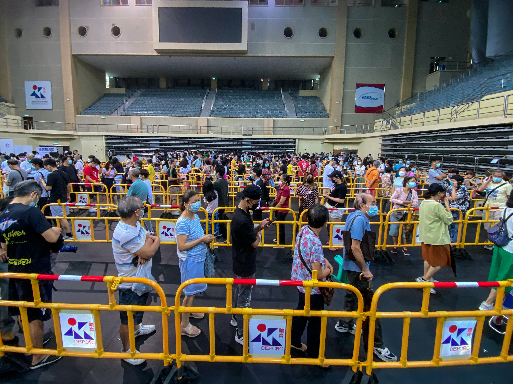

****

0-1背包问题是一个现实生活中很常见的问题，如果采用贪心策略进行求解，每次选择最贵的？性价比最高的？往往都得不到最好的解。梯度下降也是优化中常用的一种方法，如果我们精益求精，每一步都追求到极致，那么较小的步长在解决非凸优化问题时，很可能最终导致收敛于局部最优解，而得不到较好的解，通常的解决办法就是采用自适应步长的方法，当累计平方梯度较小的时候，我们不妨增大学习率，进而尝试跳出局部最优，获得更优解。

在一些启发式算法中，主要通过贪心的原则进行工作，陷入局部最优解是无法避免的，这时，我们往往引入随机化的方法，比如遗传算法中，我们通过随机初始化染色体的方法来避免陷入局部最优，而不是根据某一特定规则进行筛选。正如决策树与随机森林，随机地选择样本和属性集和，而不是通过某一特定的最优模型（比如熵增益最大来选择），是的算法的泛化能力进一步得到提升，降低了过拟合和受异常值影响的可能性。

其实，生活也是如此，我们不一定每一步都要按照前人的经验或者传统意义上的规则做到最好，在一些特定样本中，根据自己的实际情况和兴趣爱好引入一些随机化的方法，说不定在将来就会获得更优解呢？几天前去体育馆做核酸检测，由于上午满课，午饭过后的队伍已经排到了研究生宿舍，几位同学争先恐后的快步走到我的前面开始排队，生性散漫的我并没有争抢，欣然一笑，拿出了手机开始背单词。核酸检测工作人员的效率很高，队伍也很快，不一会儿就排进了体育馆。就在这时，因为检测人数较多，新增加了一个核酸检测点。一位工作人员走进我，用手指引我排向另一个队伍，刚刚好从我这里开始，前面还有好长的队，前面的几位哥们瞬间傻了眼，刚刚的局部最优解怎么瞬间不香了？

哈哈，人生多半就是如此，每一步都是最优，最终的结果不一定就会最好！不必执着于每一步是否是最优的，因为，今天的最优不代表明天依然是最优的。勇于开拓，突破传统，敢于走自己的路，在几个较优解中做出自己的选择。从这个角度来看，今天所谓的内卷在明天会占有多大的优势呢？

奥斯特洛夫斯基在《钢铁是怎样炼成的》中写道：“人最宝贵的东西是生命。生命属于我们只有一次。人的一生应当这样度过：当回忆往事的时候，他不为虚度年华而痛悔，也不为碌碌无为而羞愧；在临死的时候，他能够说：‘我的整个生命和全部精力，都已经献给世界上最壮丽的事业？为人类的解放而斗争’。”

“年轻人，你的职责是平整土地，而非焦虑时光。你做三四月的事，在八九月自有答案。”充分利用好当下的每一份资源，努力学习，努力奋斗，把剩下的一切交给时间，这才是当今时代我辈应该做的事情吧！

每一步都走到最好不一定最终结果就是最好！坚守心中的梦想，脚下的路才会更加坚定，当下的劣势说不定就是明天的优势，做好自己的事情，不为一时的失利而患得患失，未来说不定会更美好！
