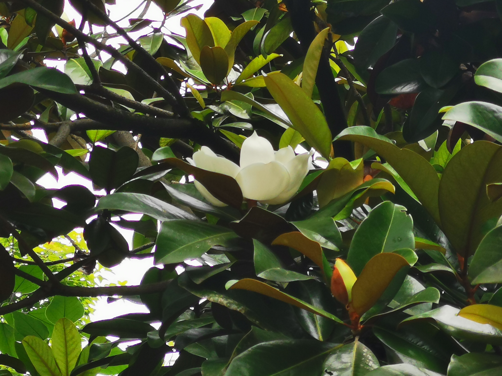
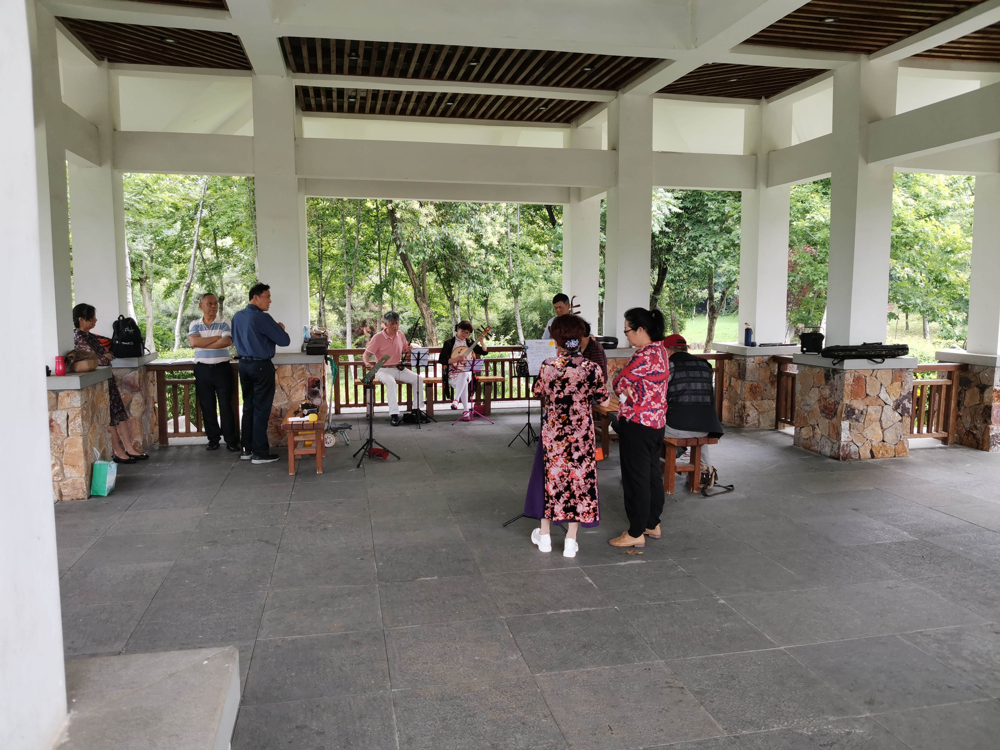

****

端午外出游玩，这次没有清明外出玩的地方多，因为好多想去的地方，上次就已经去过了！上图！

最先去的地方就是马鞍山森林公园，离华科很近，感觉就是华科的后花园哈哈！隔着围墙看到了华科的光学与电子信息学院，很宏伟，不愧是国内排得上号的顶级985，这么棒的校园，希望自己将来也能有幸逛一逛，不过地大也很棒哦~哈哈！

P1：据同学所说，这种植物叫做罗汉松，胖胖的，矮矮的，就像长着三头六臂，看起来很强壮的样子，确实很像罗汉。

P2：这里就是花海，在入口的地方有一块刻有“梦花源”的不大不小的石头！

P3：花海的花

P4：这个花很大，有两个拳头那么大，是开在树上的，6月份这个时节还没有完全开花，树上有好多花骨朵，是什么自己还不清楚呢！

P5：临走的时候，我们来到了一座小亭子里，里面有3位老大爷在拉二胡，一位大妈在弹琵琶，一位在唱歌，声音回荡在整个花海中，音乐很好听，感觉很轻松，人生各有所好，如果能找到自己喜欢的事情并可以自由地去做，是多么快乐的一件事呀！

P6：中间本来是想要去猴山看猴子去的，结果因为无意进了一家文创店参观，走到东湖边上去了。最终没看到候子，不过正如人生没有后悔走过的路一样，东湖的风带有着一股水的香气，扑面而来，驱除了身上所有的热意，瞬间去除了身上所有的热意，舒服极了，哈哈哈，轻松随性的游玩真好！

P7：在我们出行的路上，我们看到了正在吃盒饭的工人大叔和警察大哥，真的好辛苦，端午假期还要坚守自己的岗位，这时心中不由响起一句话：”从没有什么岁月静好，只不过有人在替我们负重前行！“说得真好！我默默地打开相机，留下了他们的背影。

中午吃了一顿烤肉，晚上看了场电影，可能是因为我还是对观赏自然风光更感兴趣一些吧，并没有留下照片，对了，晚上看完电影后还去光谷步行街喝了两碗米汤，由于中午吃完烤肉又没怎么活动，实在不想吃东西了，阿姨人很好，要免费送我，这怎么行呢，最终还是与阿姨商量着扫了1元钱。

哈哈哈，就这样，愉快地端午一日游就结束啦！

