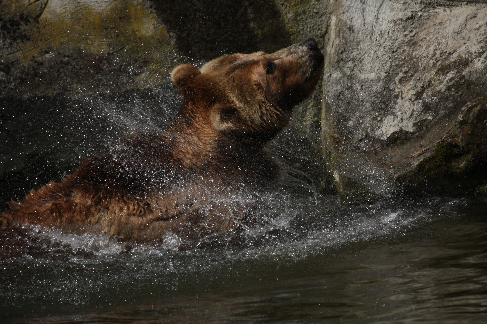

****

很多时候我们都在抱有幻想，幻想一夜暴富，幻想考试超常发挥，甚至幻想他人认可的眼光，幻想通过一个较短的周期超越别人……这些都会造成我们的焦虑、烦恼、厌学、emo，甚至抑郁……仔细想一下我们就会明白为什么要幻想，因为得不到，为什么得不到，主客观因素都没有满足，想还得不到——不抑郁才怪。

为什么要超越别人？为什么要得到别人的认可？为什么要超常发挥？我认为源头就是没有认识自己，认识自己的人生追求，认识自己的人生价值，认识究竟什么事情对自己最重要……仔细想一下，人外有人，天外有天，什么时候也不可能超越所有人，欲望永不休止，永远存在于痛苦之中；世界上的人千千万，什么时候也不可能使得所有都对自己满意，永远存在于痛苦之中；自己的能力有限，就像中彩票一样，可以超长发挥一次，但是不可能永远都尽如人意。所以这样想来我们的追求永远也没有尽头，而如果每个人都这样去想，那么内卷可能就诞生了，所有人在一个评价体系下去竞争……

起初的我甚至不明白什么是内卷，同学们谈起内卷我甚至以为是一种褒义词，也就是努力、刻苦、勤奋的意思。直到有一天，同学告诉我，有些抱怨的说道“计算机好卷呐”，我说“卷难道不是一件好事情吗？”他给我解释了一番，说“卷”是在资源和产生的价值一定的情况下，人们无休止的竞争，这会导致最终获得的收益一定，但是付出的成本加倍。我才知道，卷原来是一个贬义词。

后来我仔细想了一下，如果把学习看作只是为了绩点，分数只是为了竞争保研名额或者某些奖学金来看的话，这确实是一种内卷。因为我们在做课程开始前就已经把课程最终考核看作了课程的全部内容，而不是体验学习过程，思考自己的能力培养。这样下来，资源是有限的，分数确实永远趋近于满分的，我们不断努力，不断的逼近，但是最终的保研名额就是一定的，努力用错了方向，可能就是卷吧！

许多课程都有课程实习，但是不知多少同学在向我分析的选题的侧重点是难易程度，实践的侧重点是如何更简单的完成任务，使得老师满意，最终获得理想的分数。英语等级考试，本是对英语能力得一种考察，却总是存在过度追求答题技巧，去刷题的情况，刷题没有错，可以熟悉体型，但是刷多了呢？或者英语学习就等于刷题呢？难道我们学习英语就只是为了考这套试卷上的题目？更多的，我想是如何更好的与人交流，如何更准确的把握外文文献……看似获得了较高的绩点，实则放弃了专业能力的培养；看似获得了较高的英语水平等级，实则放弃了自己的英语基本功，而出发点错了，往往事与愿违。

生活就是这样，很多时候，我们拥有的东西自己不去珍惜，没有的东西过分强求。人生最美好的地方就在于每个人都是不同的，每个人都有自己的专长，自己的优势。但却总有人拿着自己的缺点去和别人的优点去比，抱怨绩点不如别人高，但是却忘记了自己能歌善舞、才艺丰富；总有人抱怨自己不会交际，却忘记了自己有一个强健的体魄，是运动场上的健儿；总有人抱怨自己科研能力薄弱，却忘记了自己的语言表达……

记忆能力没有别人强，数学功底没有别人扎实，英语基础薄弱……缺点很多，毋需抱怨，因为总有一个领域适合自己，总有一个专长属于自己。找到自己的长处，发展它，坚持下去，放弃幻想，一步一个脚印，脚踏实地地把路走下去，过程中就会对它产生浓厚的兴趣。把目光放向长远，做长期的投资，在自己的领域里，做着自己喜欢做的事情，成就会低得了吗？从这个角度来看，内卷只是一种目光短浅的及时满足罢了，不过是放弃自己长远的发展，来获得短暂的成就感，对自己来说无非是一种损失，也就不复存在了吧。

在此引用一下一位院士团队的同学所分享的句子，自己也是十分喜欢：

Some of us get dipped in flat, some in satin, some in gloss. But every once in a while you find someone who's iridescent, and when you do, nothing will ever compare.

有人住高楼，有人在深沟，有人光万丈，有人一身锈，世人万千种，浮云莫去求，斯人若彩虹，遇上方知有。

找准放向，放眼未来，水到渠成，顺其自然！

