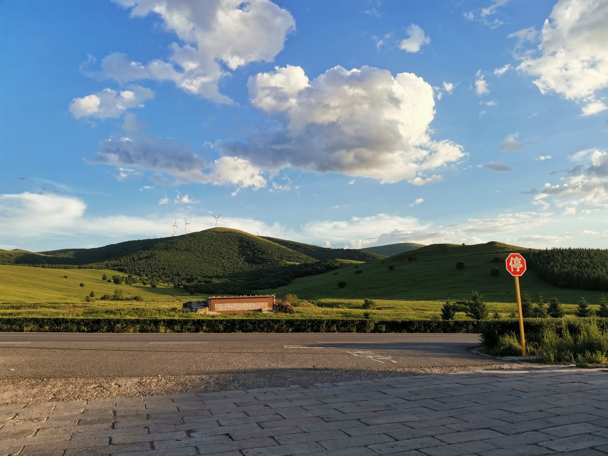
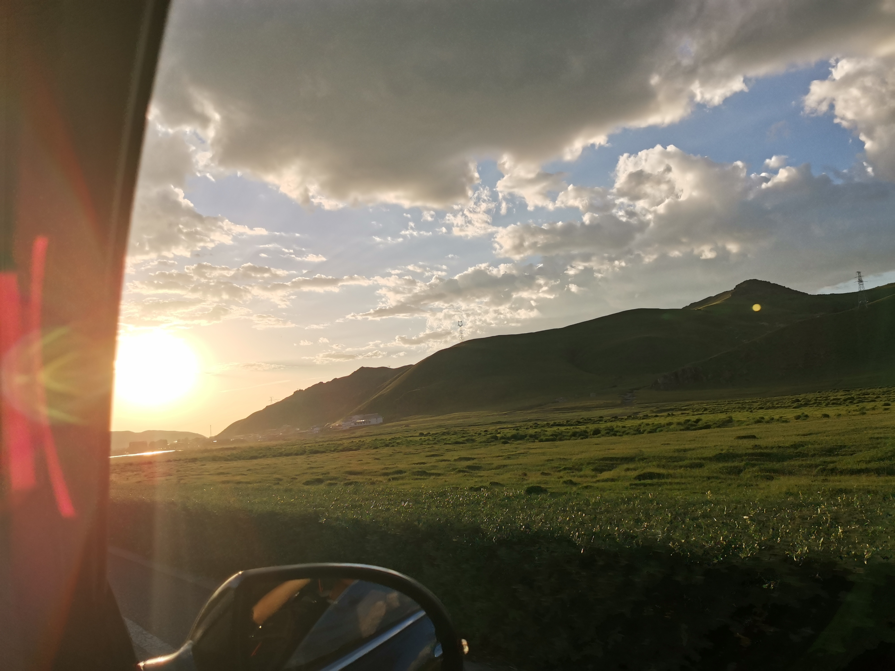
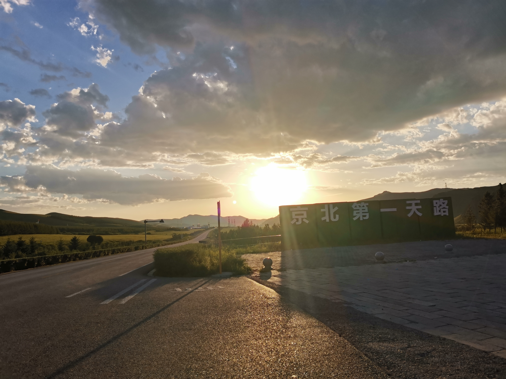
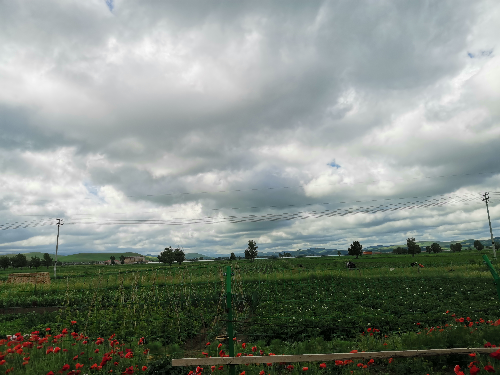
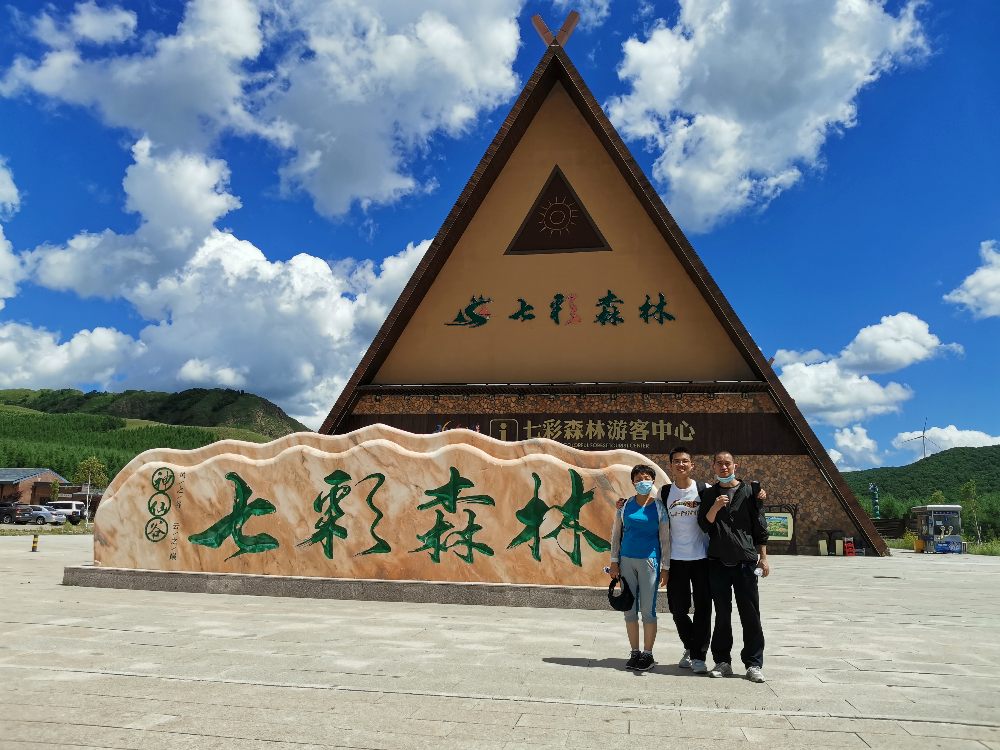
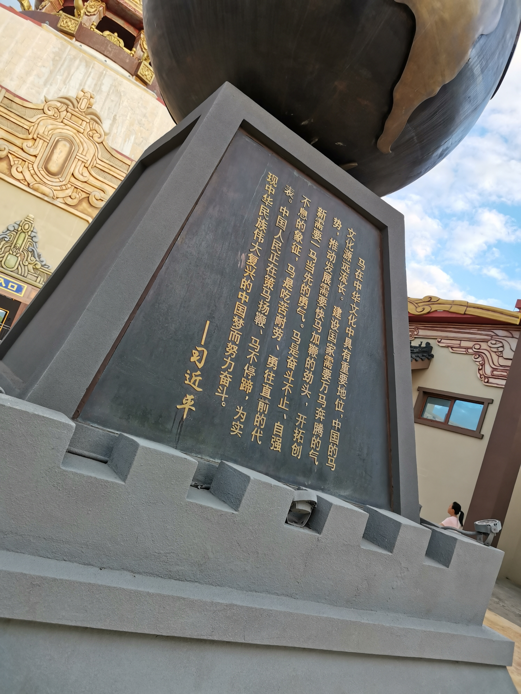
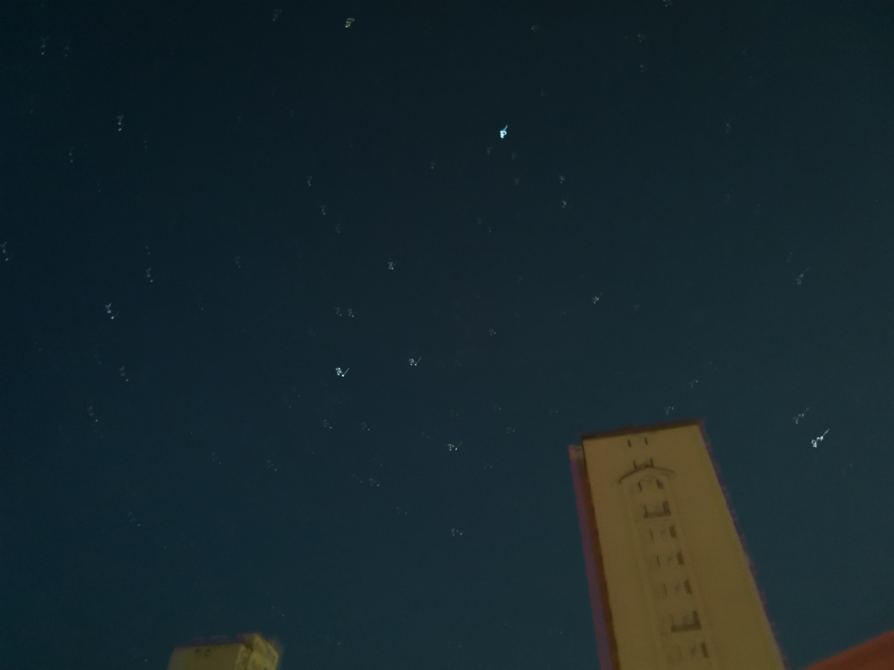

---

周末去草原游玩，感觉很nice，游玩了白云古洞，喝到了正宗的蒙古奶茶，骑到了马，看到了美丽的草原！真的是太棒了，这几天正好有时间，赶紧记录一下！！

最先来到的是白云古洞，好漂亮，看起来很震撼！

十八盘山路走到了最后一盘，现在想想当时的脚好累！(●'◡'●)

二仙洞的云梯真的好险，一个直上直下的云梯，自己和老妈爬到了最顶端，心里还是没少打鼓的(^///^)！

在白云古洞玩完之后，我们就去了草原，准备去感受一下坝上的气候，草原的晚霞好美！

下面这段公路号称京北第一公路，留念！

早上起来，准备去骑马，走出旅店，迎面看到的云彩好美——草原风情！

自己骑马时的照片，第一次独自骑着马在草原上跑起来，真的是好有成就感！

这个小马好听话，非常温顺，之前骑马都是别人牵着的，20岁，解锁骑马！

骑完马后，我们去了七彩森林，景色真的好美，和老爸老妈的合照儿hhh(\*/ω＼\*)

七彩森林的草原！

木栈道！

走了好远好远，终于来到了天镜湖，草原上的湖泊，真的好美，能在干旱的草原留存下来，也是着实不易！

老爸老妈！

马镇的名马好可爱，忍不住摸了摸！

马镇的天马，哈哈哈，自己的属相哦~留影纪念！

总书记说，马在中华文化中具有重要地位，中国的马文化源远流长！

马镇之旅到此结束！哈哈哈，下次再来啦！返程开启！

回到家后，看到了家乡的星星，好美，看我的honor AI相机，嘿嘿☆*: .｡. o(≧▽≦)o .｡.:*☆！

